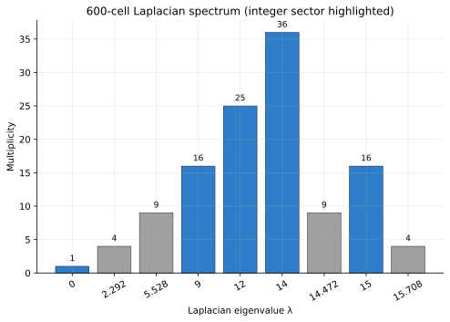
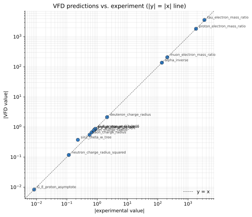
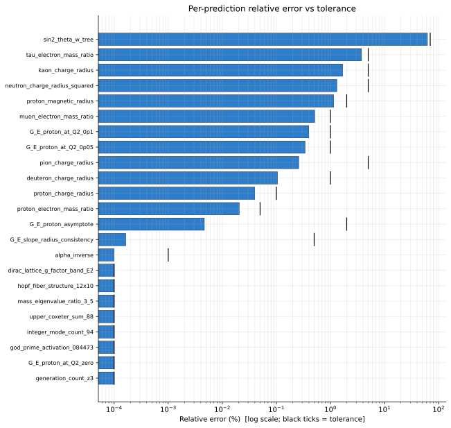
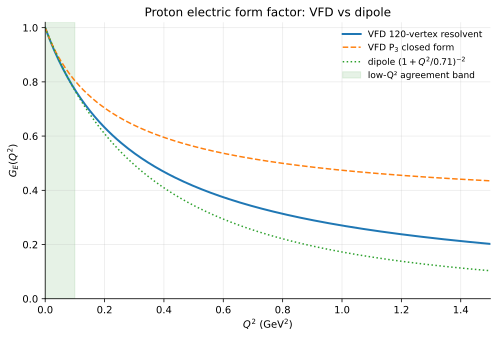

# Figures

All figures on this page are auto-generated from the live registry
by `vfd figures`. They rebuild on every push to `main` via CI.

## 1. 600-cell Laplacian spectrum

The 120-vertex Laplacian has nine distinct eigenvalues. The integer
sector (highlighted in blue) carries the mass and coupling structure
— sum of multiplicities 1 + 16 + 25 + 36 + 16 = **94**, the
`integer_mode_count_94` registered prediction.



## 2. VFD vs experiment

Every registered prediction that has an experimental target plotted
on a log-log scatter. Points close to the `y = x` diagonal match
experiment; blue points pass registry tolerance, red fail. The
clustering around the diagonal across four orders of magnitude is
the framework's headline claim made visible.



## 3. Relative error per prediction

Horizontal bars: one per prediction, log-scale on the x-axis. The
small black tick on each bar marks that prediction's registered
**tolerance**. Bars to the left of the tick pass; to the right
fail. This is the credibility table in visual form.



## 4. Proton form factor $G_E(Q^2)$

Three curves for the same observable:

- **VFD 120-vertex resolvent** — the framework's canonical prediction.
- **VFD $P_3$ closed form** — simpler analytic form; correct slope
  at $Q^2 = 0$, diverges at mid-$Q^2$.
- **Dipole** — the standard phenomenological fit to scattering data.

The three agree in the shaded low-$Q^2$ band (≤ 0.1 GeV²) where
elastic-scattering measurements are most precise. Beyond that, the
VFD resolvent and the dipole diverge — this is expected, because the
dipole is a smooth fit while the VFD form factor has explicit
spectral structure from the 600-cell Laplacian.



## Regeneration

```bash
vfd figures --out docs/figures/
```

This reads the live registry and rewrites all SVGs (and PNG
fallbacks). CI runs this automatically before `mkdocs build` so the
published site is always consistent with the current framework state.
